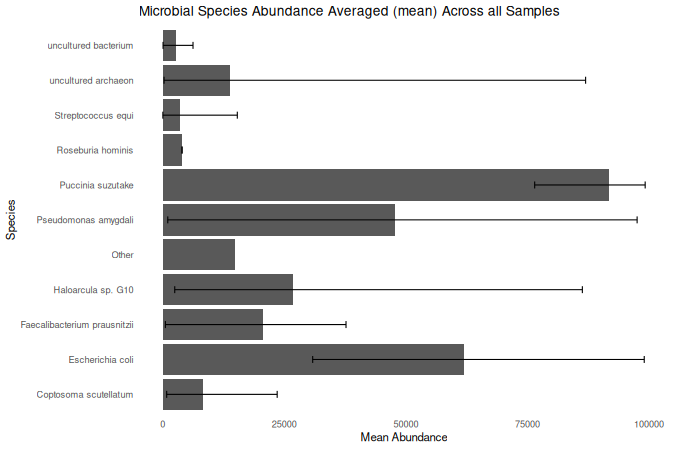
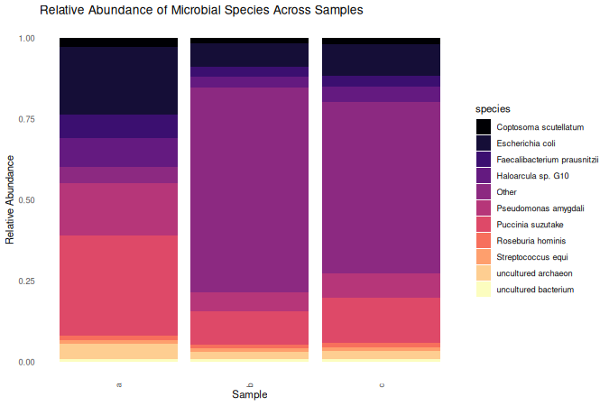
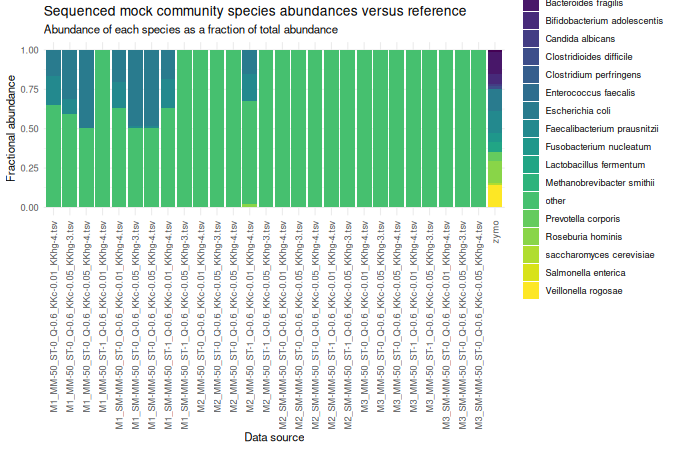
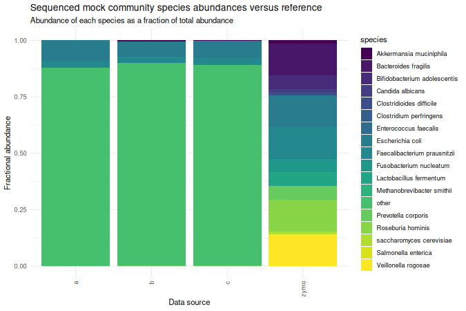
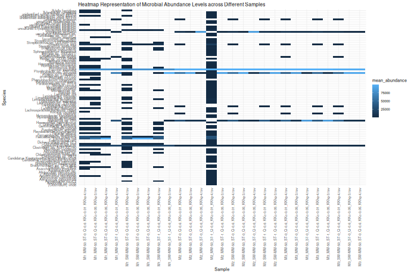
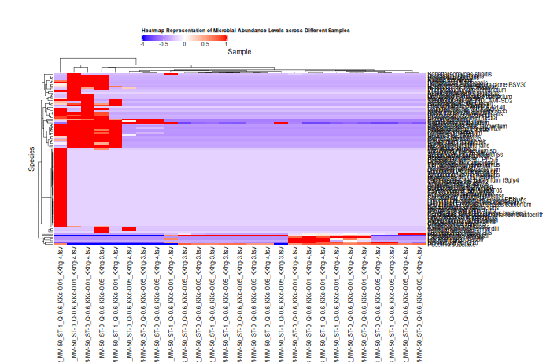
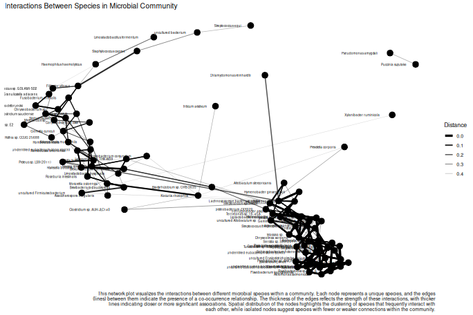
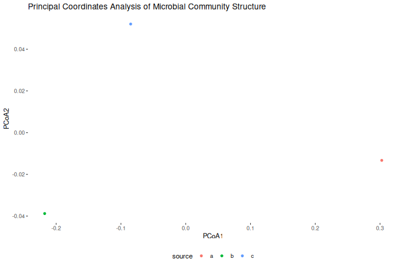
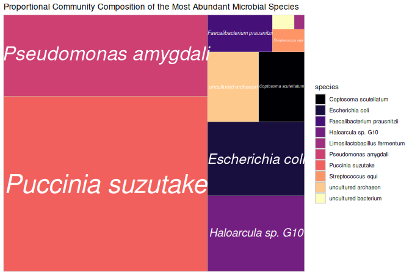

## Introduction

A suite of tools for exploratory visualization of abundance data from
amplicon sequencing.

James Swift, University of Bath, 2024.

## Setup

This utility has a number of R dependencies which need to installed
(found in the `renv.lock` file), although the setup process is
automated.

From the command line:

    R -e "install.packages('renv')"
    R -e "renv::restore('/home/$USER/Documents/microbiome_analysis/')"

From an R session:

    install.packages("renv")
    renv::restore("/home/$USER/Documents/microbiome_analysis/")

Packages such as `tidyverse` often have many system dependencies which
occassionally require manual installation, however this is out of scope
of this vignette. Such package install error messages tend to be
informative anyway, so it’s a fairly simple process.

## Basic usage

Tools in this repository may either be run from the command line, or
from within R itself, although usage is a little different.

### Command line interface

This aims to be as simple as possible, with each tool able to run with a
single shell command.

    # Example construction
    Rscript /home/user/path/to/script.R --argument1 value --argument2 value

    # Example in shell script
    Rscript /home/$USER/Documents/microbiome_analysis/R/pcoa.R -w /home/$USER/Documents/microbiome_analysis/R/pcoa.R --data /home/$USER/Documents/data/ --output /home/$USER/Downloads/

Typical arguments include a path to the utility, a data path, and an
output path. When running from a shell script it may be desirable to set
these paths as variables.

    utility_path="/home/$USER/Documents/microbiome_analysis/"
    data_path="/home/$USER/Documents/data/"
    output_path="/home/$USER/Downloads/"

    Rscript "$utility_path/R/pcoa.R" -w $utility_path --data $data_path --output $output_path

Information on available arguments can be found using the `--help` flag.

    Rscript /home/$USER/Documents/microbiome_analysis/R/pcoa.R --help

The `--data` flag allows for either a single directory containing `tsv`
files to be specified, or multiple directories, separated by spaces.

    data_path="/home/$USER/Documents/microbiome_analysis/data/a/ /home/$USER/Documents/microbiome_analysis/data/b/ /home/$USER/Documents/microbiome_analysis/data/c/"

### Interactive R session

First, set the path of the tools directory.

    script_dir <- "/home/james/Documents/microbiome_analysis/"

When working from within R, it is assumed that data needs to be loaded
for the duration of the session. Therefore, when individual plotting
functions are called interactively, *cleaned* data must be passed as an
argument. This aims to reduce complexity of functions and minimize
dependencies.

This is pretty simple, though.

    source(paste0(script_dir, "R/data.R"))

    user_data <- load_user_data_dir("/home/user/path/to/data/")
    check_data(user_data)

Calling `check_data` is not necessary, but ensures that further
functions receive data in an expected format.

Two functions are available for loading data, allow a single file, an
entire directory, or multiple directories to be loaded at once.

    # Single file
    user_data <- load_user_data("/home/user/path/to/data/file.tsv")

    # Single directory
    user_data <- load_user_data_dir("/home/user/path/to/data/")

    # Multiple directories
    user_data <- load_user_data_dir(c("/home/user/path/to/data/a/",
                                      "/home/user/path/to/data/b/",
                                      "/home/user/path/to/data/c/")

This data can then be passed to plotting functions.

    pcoa <- do_pcoa(user_data, zero_missing = TRUE)
    pcoa

Documentation for each function can be found using the console.

    ?load_user_data_dir
    ?do_pcoa

## Function examples

### Bar plots

Designed to compare abundance across samples. Plot can either be
vertically or horizontally arranged, and a max number of samples can be
specified to be plotted (i.e. x most abundance species).

    make_barplot(user_data, orientation = "horizontal", max = 10)

    make_stacked_barplot(user_data_multi, orientation = "vertical", max = 10)

### Controls

Plots community composition against the ZymoBIOMICS standard.

    plot_controls(user_data)

    plot_controls(user_data_multi)

Calculates the difference in community composition between each sample
and the standard

    analyze_processing_configs(user_data, best_method = FALSE)

<table>
<thead>
<tr class="header">
<th style="text-align: center;">method</th>
<th style="text-align: center;">total_difference</th>
</tr>
</thead>
<tbody>
<tr class="odd">
<td
style="text-align: center;">M2_MM-50_ST-1_Q-0.6_KKc-0.01_KKhg-4.tsv</td>
<td style="text-align: center;">38.67</td>
</tr>
<tr class="even">
<td
style="text-align: center;">M1_SM-MM-50_ST-0_Q-0.6_KKc-0.01_KKhg-4.tsv</td>
<td style="text-align: center;">42.76</td>
</tr>
<tr class="odd">
<td
style="text-align: center;">M1_MM-50_ST-0_Q-0.6_KKc-0.01_KKhg-4.tsv</td>
<td style="text-align: center;">42.8</td>
</tr>
<tr class="even">
<td
style="text-align: center;">M1_SM-MM-50_ST-1_Q-0.6_KKc-0.01_KKhg-4.tsv</td>
<td style="text-align: center;">43</td>
</tr>
<tr class="odd">
<td
style="text-align: center;">M1_MM-50_ST-0_Q-0.6_KKc-0.05_KKhg-3.tsv</td>
<td style="text-align: center;">50.7</td>
</tr>
<tr class="even">
<td
style="text-align: center;">M1_SM-MM-50_ST-0_Q-0.6_KKc-0.05_KKhg-3.tsv</td>
<td style="text-align: center;">68.81</td>
</tr>
<tr class="odd">
<td
style="text-align: center;">M1_SM-MM-50_ST-0_Q-0.6_KKc-0.05_KKhg-4.tsv</td>
<td style="text-align: center;">68.81</td>
</tr>
<tr class="even">
<td
style="text-align: center;">M1_MM-50_ST-0_Q-0.6_KKc-0.05_KKhg-4.tsv</td>
<td style="text-align: center;">71.02</td>
</tr>
<tr class="odd">
<td
style="text-align: center;">M1_MM-50_ST-1_Q-0.6_KKc-0.01_KKhg-4.tsv</td>
<td style="text-align: center;">98.99</td>
</tr>
<tr class="even">
<td
style="text-align: center;">M1_SM-MM-50_ST-1_Q-0.6_KKc-0.05_KKhg-3.tsv</td>
<td style="text-align: center;">98.99</td>
</tr>
<tr class="odd">
<td
style="text-align: center;">M2_MM-50_ST-0_Q-0.6_KKc-0.01_KKhg-4.tsv</td>
<td style="text-align: center;">98.99</td>
</tr>
<tr class="even">
<td
style="text-align: center;">M2_MM-50_ST-0_Q-0.6_KKc-0.05_KKhg-3.tsv</td>
<td style="text-align: center;">98.99</td>
</tr>
<tr class="odd">
<td
style="text-align: center;">M2_MM-50_ST-0_Q-0.6_KKc-0.05_KKhg-4.tsv</td>
<td style="text-align: center;">98.99</td>
</tr>
<tr class="even">
<td
style="text-align: center;">M2_MM-50_ST-1_Q-0.6_KKc-0.05_KKhg-3.tsv</td>
<td style="text-align: center;">98.99</td>
</tr>
<tr class="odd">
<td
style="text-align: center;">M2_SM-MM-50_ST-0_Q-0.6_KKc-0.01_KKhg-4.tsv</td>
<td style="text-align: center;">98.99</td>
</tr>
<tr class="even">
<td
style="text-align: center;">M2_SM-MM-50_ST-0_Q-0.6_KKc-0.05_KKhg-3.tsv</td>
<td style="text-align: center;">98.99</td>
</tr>
<tr class="odd">
<td
style="text-align: center;">M2_SM-MM-50_ST-0_Q-0.6_KKc-0.05_KKhg-4.tsv</td>
<td style="text-align: center;">98.99</td>
</tr>
<tr class="even">
<td
style="text-align: center;">M2_SM-MM-50_ST-1_Q-0.6_KKc-0.01_KKhg-4.tsv</td>
<td style="text-align: center;">98.99</td>
</tr>
<tr class="odd">
<td
style="text-align: center;">M2_SM-MM-50_ST-1_Q-0.6_KKc-0.05_KKhg-3.tsv</td>
<td style="text-align: center;">98.99</td>
</tr>
<tr class="even">
<td
style="text-align: center;">M3_MM-50_ST-0_Q-0.6_KKc-0.01_KKhg-4.tsv</td>
<td style="text-align: center;">98.99</td>
</tr>
<tr class="odd">
<td
style="text-align: center;">M3_MM-50_ST-0_Q-0.6_KKc-0.05_KKhg-3.tsv</td>
<td style="text-align: center;">98.99</td>
</tr>
<tr class="even">
<td
style="text-align: center;">M3_MM-50_ST-0_Q-0.6_KKc-0.05_KKhg-4.tsv</td>
<td style="text-align: center;">98.99</td>
</tr>
<tr class="odd">
<td
style="text-align: center;">M3_MM-50_ST-1_Q-0.6_KKc-0.01_KKhg-4.tsv</td>
<td style="text-align: center;">98.99</td>
</tr>
<tr class="even">
<td
style="text-align: center;">M3_MM-50_ST-1_Q-0.6_KKc-0.05_KKhg-3.tsv</td>
<td style="text-align: center;">98.99</td>
</tr>
<tr class="odd">
<td
style="text-align: center;">M3_SM-MM-50_ST-0_Q-0.6_KKc-0.01_KKhg-4.tsv</td>
<td style="text-align: center;">98.99</td>
</tr>
<tr class="even">
<td
style="text-align: center;">M3_SM-MM-50_ST-0_Q-0.6_KKc-0.05_KKhg-3.tsv</td>
<td style="text-align: center;">98.99</td>
</tr>
<tr class="odd">
<td
style="text-align: center;">M3_SM-MM-50_ST-0_Q-0.6_KKc-0.05_KKhg-4.tsv</td>
<td style="text-align: center;">98.99</td>
</tr>
</tbody>
</table>

### Density

Compare abundance distribution across samples. Note that if more than 10
samples are present, a legend will not be shown.

    make_density_plot(user_data_multi)

### Heat maps

Two different heat maps are available: a simpler heat map with a cleaner
design, as well as a heat map showing both species and sample
clustering. Note plot resolutions are compressed for this vignette so
text may overlap.

    make_heatmap(user_data)

    hm <- make_clustered_heatmap(user_data)

### Networks

Visualizes relationship between species calculated from multiple
samples. Various distance methods can be used, and max distance between
points can be specified to provide a cutoff for the strength of
relationships between points. See `plot_net()` from the `phyloseq`
library for availabvle distance methods.

    physeq_object <- create_physeq_object(data = user_data)
      
    create_network_phyloseq(physeq_object = physeq_object,
                                         distance_method = "bray",
                                         max_dist = 0.5)

### PCoA

Creates a PCoA plot to visualize beta-diversity (community composition
differences between samples). Note that if more than 10 samples are
present, a legend will not be shown. `zero_missing` replaces any missing
values with zeros e.g. if one sample has data for a species that other
samples do not. Setting this option to `FALSE` may limit the
effectiveness of this analysis.

    do_pcoa(user_data_multi, zero_missing = TRUE)

### Tree map

Displays a minimalist representation of species abundance, averaged
(mean) across samples.

    make_treemap(user_data, max = 10)

## Interoperatibility

### Docker

You may want to run this in Docker, either in its own container, or as
part of a more extensive workflow. Set up takes a little longer, but
generally allows for easier dependency management and interoperatibility
in the future.

Detailed instructions are out of scope for this document, but some basic
commands for getting started are listed below (these can also be found
in `inst/scripts/`).

An example `Dockerfile` can be found in the parent directory of this
repository.

#### Building an image

    # Stop container if running
    sudo docker container stop microbiome-analysis

    # Remove old container if present
    sudo docker container rm microbiome-analysis-container

    # Remove old image if present
    sudo docker image rm microbiome-analysis

    # Build image
    DOCKER_BUILDKIT=1 sudo docker build -t microbiome-analysis .

    # Launch container
    sudo docker run -d --name microbiome-analysis-container microbiome-analysis

    # Use container interactively
    docker exec -it microbiome-analysis-container /bin/bash

#### Running inside a container

    # Copying data into a container
    docker cp /home/$USER/Documents/data.tsv microbiome-analysis-container:/usr/local/bin/data.tsv

    # Running commands in a Docker container
    docker exec microbiome-analysis-container Rscript /usr/local/bin/microbiome_analysis/pcoa.R --arguments ...

    # Copying from container to local environment
    docker cp microbiome-analysis-container:/usr/local/bin/output.jpeg ~/Downloads/

    # Running a container interactively
    docker exec -it microbiome-analysis-container /bin/bash

### Python

It is technically possible to run these tools from within Python.

1.  Use the `reticulate` package to import the R functions into the
    Python environment (best)
2.  Use `subprocess.call()` to execute shell commands
3.  Use `os.system()` to execute shell commands

Executing shell commands from Python to do this is generally not the
most ideal solution, particularly as the `reticulate` module in Python
is suitably comprehensive for this use case.
